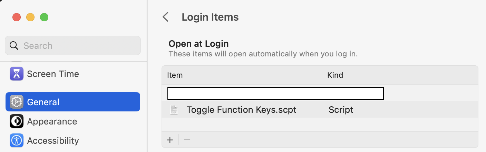

# Toggle Mac Function Keys

This AppleScript allows you to automate the toggling of using Function Keys vs Media Keys on MacOS. Useful for VS Code debugging other applications. Then, switching back to your media keys.

Essentially it does the job one would have to do manually: Open System Preferences, go to Keyboard, click "Use F1, F2 etc. keys as standard function keys".

Tested with:
* MacOS Sonoma, 14.2.1 January 2024
* MacOS Ventura, 13.2 January 2023
* MacOS Monterey, 12.6.2, December 2022
* MacOS Big Sur, 11.4, June 2021

## Instructions for use

1. On your mac, open Script Editor
2. Copy / paste the contents of `Toggle Function Keys.scpt`
3. File, Export (*note: do not use Save As, which won't ask for permissions properly*)
4. Save the script as an application:
   1. Choose filename (e.g. "Toggle Function Keys")
   2. Save to Applications Folder
   3. File format: Application
   4. Code Sign: Sign to Run Locally
5. Double click from the applications folder
6. Enable the script to be run by going into System Preferences, Security & Privacy, [unlocking the dialogue box on older MacOS versions], then selecting (usually in Accessibility) `Toggle Function Keys`. Running a second time will ask you to Allow access to control System Events - press Allow (*which adds an extra permission in Settings > Privacy & Security > Automation. If this step does not appear & the script fails to run, then go back to step 3 and ensure you choose: File, Export*)

## Running

For me, the easiest method I've found is to use `cmd` + `space` to search for "Toggle Function Keys" and run it from there. Or drag the application to the dock and click to trigger it.

Other people have had success binding to a keyboard shortcut with a paid app. e.g. [here](https://folivora.ai).

### At Startup

In a tip given from [@SoftTransistor](https://github.com/SoftTransistor) you could add the script to your login items to trigger switching keys each time you start up.

### Other ideas for running the app

Other ideas I've not had success with:

* I have tried adding an automator with "no input", adding "apple script", pasting in the code, then System Preferences, Keyboard, Shortcuts, Services - then choosing Toggle Function Keys and assiging a shortcut. Seems to only work when your focus isn't in an app which uses your assigned shortcut/seems to only activate once.
* Adding script editor to main menu - seems too messy/ugly as a solution as it's hard to restrict down to just the script
* Adding a standard keyboard shortcut to this application doesn't work as it has not "required" menu item to select

## Background

This script was adapted from other, non-working older scripts I found on the internet. Many don't seem to wait for the UI to appear, so I added that to the script. Also had the wrong UI text reference (to be fair, Apple change this between the M1 mac and old MacOS versions). Old scripts used to provide feedback via a pop up but I've removed this as this interrupts the user-flow when used a lot.

## Credits

* Credit for the basis of the `if osver > 13.0 then` section goes to [mflboys](https://www.reddit.com/user/mflboys/) for creating MacOS Ventura code [source](https://www.reddit.com/r/shortcuts/comments/yjlxvo/macos_ventura_shortcut_toggle_function_keys_f1f2/)
* Credit to [@SoftTransistor](https://github.com/SoftTransistor) for the login items tip. Thanks!
* Thanks to [@hdecoded](https://github.com/hdecoded) and [@edge3uk](https://github.com/edge3uk) for testing on macOS14 beta.
* HUGE thanks to [@cartesian-plane](https://github.com/cartesian-plane) for pointing out the use of `reveal anchor`.